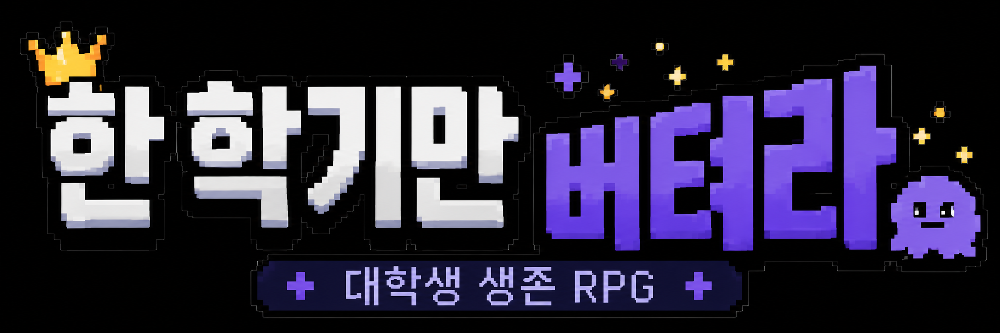

# 한 학기만 버텨라

> 개강부터 성적 확인까지, 학점과 멘탈을 들고 16주를 버티는 대학생 생존 RPG



## 프로젝트 소개

**한 학기만 버텨라**는 대학생활을 픽셀 RPG UI로 풀어낸 선택형 모바일 웹앱입니다.  
플레이어는 16주 동안 개강, 개총, MT, 과제, 팀플, 축제, 중간고사, 기말고사, 성적 확인을 지나며 선택지를 고릅니다.

좋은 선택과 나쁜 선택을 단순히 나누는 게임이 아니라, 어떤 방식으로 한 학기를 버틸지 고르는 게임입니다.

## 주요 기능

| 기능 | 설명 |
| --- | --- |
| 16주 고정 진행 | 매주 메인 이벤트를 진행하고 총 18턴으로 학기를 마무리합니다. |
| 선택형 이벤트 | 선택지마다 스탯 변화, 랜덤 결과, 칭호 획득이 발생합니다. |
| 픽셀 RPG UI | HUD, STATUS, 배너, 채팅 로그, 선택지, 엔딩 카드를 픽셀 게임 스타일로 구성했습니다. |
| 최종 엔딩 | 최종 스탯에 따라 `NORMAL`, `RARE`, `DANGER`, `ACADEMIC`, `SURVIVAL` 계열 엔딩이 결정됩니다. |
| 자동 저장 | localStorage 기반으로 진행 상황을 저장하고 이어하기를 지원합니다. |
| 사운드 설정 | BGM과 효과음 볼륨을 별도로 조절할 수 있습니다. |
| 모바일 앱 지원 | Capacitor 기반 Android 프로젝트를 포함합니다. |

## 게임 스탯

| 스탯 | 의미 |
| --- | --- |
| 멘탈 | 낮아지면 위험 엔딩 후보가 됩니다. |
| 학점 | 시험과 최종 학업 점수에 영향을 줍니다. |
| 체력 | 밤샘, MT, 체육대회, 시험기간 선택의 대가로 변합니다. |
| 지갑 | 학식, 카페, MT, 교재비 등으로 줄어듭니다. |
| 관계 | 개총, MT, 팀플, 축제에서 크게 변합니다. |
| 어그로 | 교수님 관심도가 높아질수록 위험 신호가 됩니다. |

보조 수치는 `출석`, `과제`, `중간`, `기말`만 최종 STATUS에 노출합니다.

## 이벤트 구성

- 메인 이벤트: 16개
- 랜덤 생활 이벤트: 플레이마다 2개 배정
- 총 진행 이벤트: 18턴

대표 이벤트:

- 개강
- 학과 개총
- MT
- 팀플 조 편성
- 첫 과제 더미
- 중간고사 전야
- 중간고사
- 대학 축제
- 체육대회
- 팀플 중간 점검
- 자휴 유혹
- 발표 / 레포트 시즌
- 기말고사 전야
- 기말고사
- 종강
- 성적 확인

## 기술 스택

| 영역 | 기술 |
| --- | --- |
| Frontend | React, TypeScript, Vite |
| Styling | CSS, pixel design tokens |
| Storage | localStorage |
| Mobile | Capacitor Android |
| Audio | HTMLAudioElement |

## 실행 방법

```bash
npm install
npm run dev
```

프로덕션 빌드:

```bash
npm run build
```

## Android 실행

Android Studio와 Android SDK 설치 후:

```bash
npm run mobile:sync
npm run mobile:open
```

Android Studio에서 에뮬레이터 또는 실제 기기를 선택해 실행합니다.

## 프로젝트 구조

```text
src/
  App.tsx
  assets/
  components/
  data/
  engine/
  styles/

public/university-survival/png/
  avatars
  badges
  banners
  event icons
  stat icons

android/
  Capacitor Android project
```

## 디자인 방향

- 다크 네이비와 로열 퍼플 기반의 모바일 게임 화면
- 두꺼운 픽셀 테두리와 hard shadow
- STATUS HUD, 진행바, 배너, 채팅 로그, 선택지 버튼 중심 구성
- 스크롤보다 앱 화면 안에서 조작하는 경험을 우선

## 현재 상태

- 웹 빌드 가능
- Android Capacitor sync 가능
- 18턴 게임 루프 구현
- 최종 STATUS와 엔딩 판정 구현
- 카페인 스탯 제거 완료
- 어그로 엔딩 기준 조정 완료
